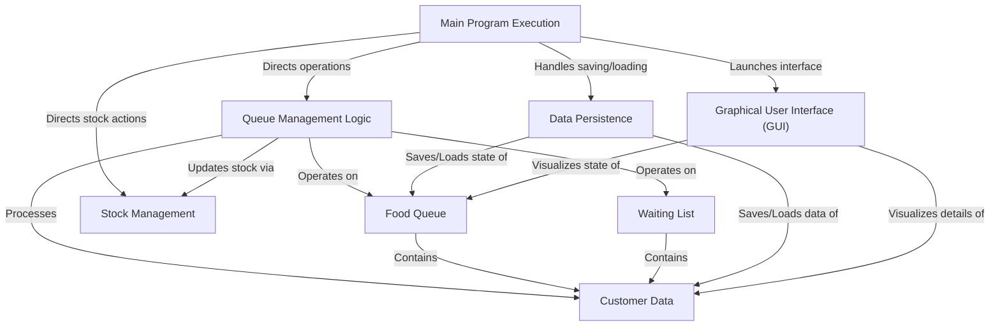
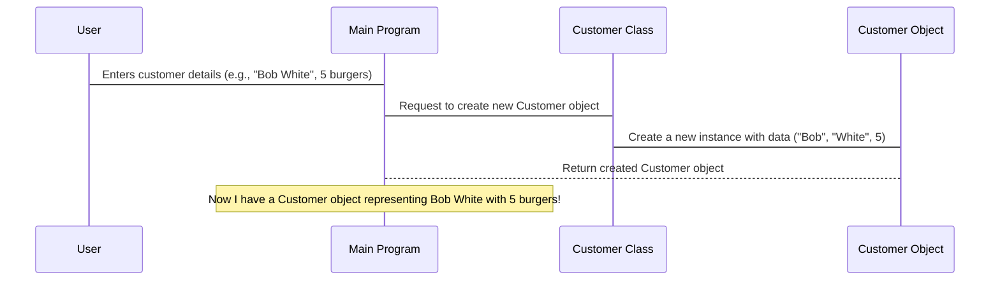
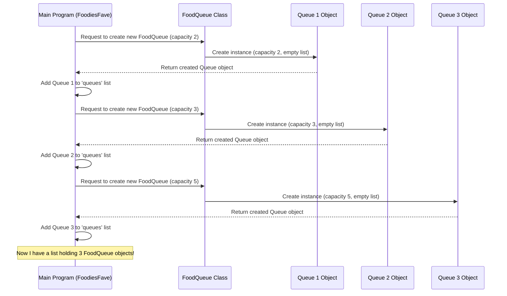
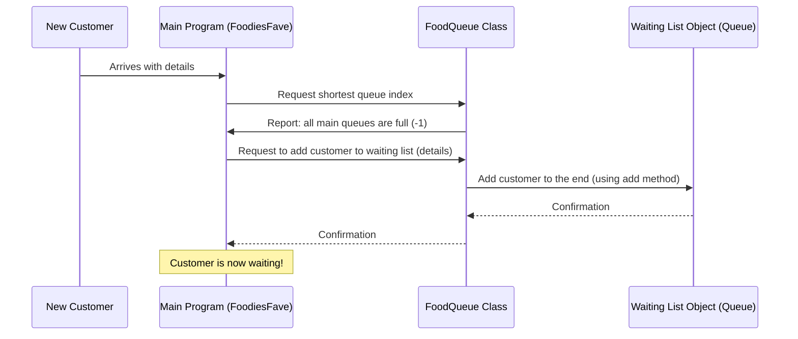
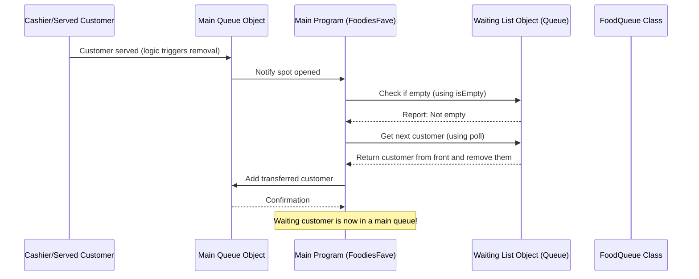
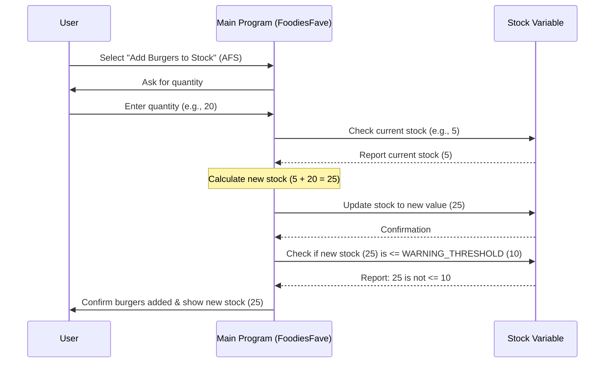
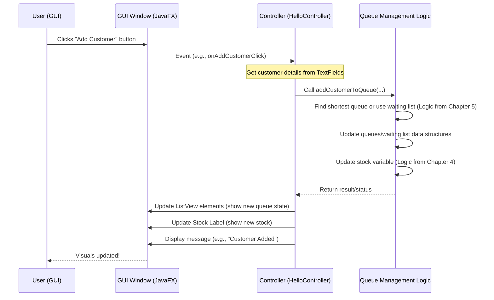

# Tutorial: Foodie-Fave

The Foodie-Fave system is designed to manage customer queues at a burger shop.
It allows tracking customers waiting in multiple queues, managing burger stock, and handles a *waiting list* when queues are full.
The system can save and load its state for **persistence** and includes an optional **graphical interface**.


## Visual Overview



## Chapters

1. [Customer Data
](01_customer_data_.md)
2. [Food Queue
](02_food_queue_.md)
3. [Waiting List
](03_waiting_list_.md)
4. [Stock Management
](04_stock_management_.md)
5. [Queue Management Logic
](05_queue_management_logic_.md)
6. [Data Persistence
](06_data_persistence_.md)
7. [Graphical User Interface (GUI)
](07_graphical_user_interface__gui__.md)
8. [Main Program Execution
](08_main_program_execution_.md)

---

<sub><sup>Generated by [AI Codebase Knowledge Builder](https://github.com/The-Pocket/Tutorial-Codebase-Knowledge).</sup></sub>

# Chapter 1: Customer Data

Welcome to the `Foodie-Fave` project! This program helps manage a burger shop with multiple cashier queues. Before we dive into how queues work, let's start with the most basic thing we need to track: the customer!

Imagine you walk into a burger shop. When you place your order, the cashier might write your name (or just an order number) on a little slip of paper. This slip represents *you* and *your order* in their system. In our `Foodie-Fave` program, we need a similar way to represent each person waiting for their delicious burgers.

This is where the concept of **Customer Data** comes in.

## What is Customer Data?

At its heart, **Customer Data** is simply the information we keep track of for each person waiting in line. Why do we need this?

*   To know *who* is waiting.
*   To know *where* they are in the queue.
*   (In more advanced versions) To know *what* they ordered (like how many burgers!).

Think of it as the digital version of that little order slip.

## The Simplest Way: Just a Name

In the most basic version of our `Foodie-Fave` program (like the one using arrays), the only piece of information we store about a customer is their **name**.

In Java programming, text like a name is stored using a `String`. So, a customer in this simple setup is just a `String` variable holding their name.

```java
// This line declares a variable to hold a customer's name
String customerName = "Alice";
```

This is the simplest way to represent a customer – just their name as a piece of text. Later in the program, we'll see how these names are placed into arrays that represent the queues.

## Adding More Information: Introducing the Customer Class

Just knowing a customer's name isn't always enough. What if we also need to know how many burgers they want? Or maybe their first and last name separately?

To hold **multiple pieces of information** together for one customer, we use something called a **class** in Java. A class is like a blueprint for creating objects that represent real-world things – in this case, a customer!

Let's look at the `Customer` class used in a more advanced version of `Foodie-Fave`. You can find this in the `Class Version/src/main/java/com/example/foodfave/Customer.java` file.

```java
package com.example.foodfave;

class Customer {
    // These are the pieces of information we store for each customer
    private String firstName;
    private String lastName;
    private int burgersRequired;

    // This is how we create a new Customer object
    public Customer(String firstName, String lastName, int burgersRequired) {
        this.firstName = firstName; // Store the first name
        this.lastName = lastName;   // Store the last name
        this.burgersRequired = burgersRequired; // Store how many burgers they want
    }

    // This method gives us the full name
    public String getFullName() {
        return firstName + " " + lastName;
    }

    // This method tells us how many burgers they need
    public int getBurgersRequired() {
        return burgersRequired;
    }
}
```

In this `Customer` class:

*   We define what information a customer object should have: `firstName` (a String), `lastName` (a String), and `burgersRequired` (a number, or `int`).
*   The special method called `Customer(...)` is used to **create** a new customer object. When you create one, you give it the first name, last name, and burger count.
*   We have methods like `getFullName()` and `getBurgersRequired()` to easily get this information from a `Customer` object.

## How We Use the Customer Data

When a new customer arrives at the shop, our program needs to create a representation of them.

*   In the simplest version, it gets their name and uses that `String`.
*   In the version with the `Customer` class, it creates a new `Customer` object using the information (like name and burgers needed).

```java
// Example of creating a Customer object using the class:
// Let's say Jane Doe wants 3 burgers.
Customer newCustomer = new Customer("Jane", "Doe", 3);

// Now 'newCustomer' is an object holding all that info!
// We can get the information out like this:
String name = newCustomer.getFullName(); // Gets "Jane Doe"
int burgers = newCustomer.getBurgersRequired(); // Gets 3

System.out.println(name + " wants " + burgers + " burgers.");
```

This `Customer` object (or just the `String` name in the simpler version) is what our program will manage as it moves through the waiting process.

## What Happens When We Represent a Customer?

Let's think about what happens behind the scenes when we decide to represent a new customer using the `Customer` class.

Imagine you are the computer program:

1.  Someone provides the customer's details: First Name, Last Name, Burgers Needed.
2.  The program needs to create a `Customer` object.
3.  It calls the `Customer(...)` method (the 'constructor') with the details provided.
4.  Inside the constructor, the program sets up a new package (the `Customer` object).
5.  It labels the package with the `firstName`, `lastName`, and `burgersRequired` that were provided.
6.  The program now has this complete `Customer` package ready to be used – maybe added to a queue!

Here's a simple way to visualize that step:



This `Customer` object now holds all the relevant information for that one waiting person, bundled together nicely. Whether it's just a name (`String`) or a more detailed object (`Customer` class), the key idea is that we have a way to identify and track each individual waiting person in our system.

## Summary

In this chapter, we learned that **Customer Data** is how we represent the people waiting for burgers in our `Foodie-Fave` system.

*   In the simplest form, this is just the customer's name, stored as a `String`.
*   For more detail, we can use a `Customer` **class** which acts as a blueprint to hold multiple pieces of information like first name, last name, and the number of burgers required.

This customer data is the fundamental building block. Now that we know how to represent a customer, the next logical step is to figure out how to manage groups of these customers waiting in line.

Let's move on to the next chapter where we'll explore how we manage customers waiting in a line, which we call a **Food Queue**.

[Food Queue](02_food_queue_.md)

---

<sub><sup>Generated by [AI Codebase Knowledge Builder](https://github.com/The-Pocket/Tutorial-Codebase-Knowledge).</sup></sub> <sub><sup>**References**: [[1]](https://github.com/Sehandu-Siriwardhana/Foodie-Fave/blob/2ea090bcadc5289c0dd6e02ee016de3bb2cd8b9d/Array Version/src/Foodies_Fave_Queue_Management_System.java), [[2]](https://github.com/Sehandu-Siriwardhana/Foodie-Fave/blob/2ea090bcadc5289c0dd6e02ee016de3bb2cd8b9d/Class Version/customer_data.txt), [[3]](https://github.com/Sehandu-Siriwardhana/Foodie-Fave/blob/2ea090bcadc5289c0dd6e02ee016de3bb2cd8b9d/Class Version/src/main/java/com/example/foodfave/Customer.java)</sup></sub>

# Chapter 2: Food Queue

Welcome back, future burger shop manager! In [Chapter 1: Customer Data](01_customer_data_.md), we learned how to represent each person waiting for their tasty burgers. We saw that a customer could be as simple as a name (a `String`) or a more detailed object holding information like their name and how many burgers they want.

But just having a customer isn't enough! Customers don't just appear out of thin air; they usually wait in a **line**. At our `Foodie-Fave` burger shop, these lines are called **Food Queues**.

## What is a Food Queue?

Think about visiting a busy shop. You find a lane to pay, right? That lane is a queue! A **Food Queue** in our program is the digital version of one of those lanes. It's a structured place where customers wait their turn to be served by a cashier.

Here are the key ideas about Food Queues in `Foodie-Fave`:

1.  **It holds Customers:** A queue is like a container specifically designed to hold our [Customer Data](01_customer_data_.md).
2.  **It's Ordered:** Customers join the back of the line and are served from the front (First-In, First-Out, or FIFO).
3.  **It has Limited Space:** Just like a real checkout lane can only fit so many people, each of our Food Queues has a maximum capacity.

Our `Foodie-Fave` system manages *multiple* Food Queues, allowing several cashiers to serve customers at the same time.

## Why Do We Need Food Queues?

The main problem Food Queues solve is **managing the flow of customers**. Without queues, customers would just be a big, unorganized group. Queues help us:

*   Keep track of who is waiting.
*   Know the order in which customers should be served.
*   Distribute customers among available cashiers (or lanes).
*   Understand when a line is full.

The core use case for a Food Queue is simply: **representing a line of customers waiting to be served.**

## Representing a Single Food Queue

How do we create this "container" for customers in our Java program? There are a couple of ways depending on which version of `Foodie-Fave` you look at.

### Simple Way: Using Arrays

In the simpler, array-based version of the program (`Array Version/src/Foodies_Fave_Queue_Management_System.java`), a Food Queue is represented by a simple array of `String` objects. Why `String`? Because in this version, we only store the customer's name (a `String`) as their data.

The size of the array determines the queue's **capacity**.

```java
// This line creates an array that can hold 2 customer names (Strings)
private static final String[] queue1 = new String[2];

// This creates an array for queue 2 with capacity 3
private static final String[] queue2 = new String[3];

// This creates an array for queue 3 with capacity 5
private static final String[] queue3 = new String[5];
```

*Explanation:* Each of these lines declares an array (`queue1`, `queue2`, `queue3`). We use the `new String[...]` part to say it's an array of `String`s and specify its fixed size (its capacity). For example, `queue1` can hold a maximum of 2 customers. Initially, all spots in the array are empty (`null`).

When a customer joins the queue, their name (`String`) is placed into the first available `null` spot in the array.

### Better Way: Using the `FoodQueue` Class

In the more advanced, class-based version of the program (`Class Version/src/main/java/com/example/foodfave/FoodQueue.java`), we use a dedicated **class** called `FoodQueue`. This is a more organized way to handle the queue's information and actions.

Just like the `Customer` class bundles customer details, the `FoodQueue` class bundles:

*   Its `capacity` (how many customers it can hold).
*   The list of `customers` currently in the queue.

```java
package com.example.foodfave;

import java.util.ArrayList; // We'll use an ArrayList to hold customers
import java.util.List;

class FoodQueue {
    private int capacity;          // Stores the maximum number of customers
    private List<Customer> customers; // Stores the list of customers in the queue

    // This is how we create a new FoodQueue object
    public FoodQueue(int capacity) {
        this.capacity = capacity; // Set the queue's capacity
        customers = new ArrayList<>(); // Create an empty list to hold customers
    }

    // ... other methods for adding/removing customers, checking size, etc. ...
}
```

*Explanation:* This snippet shows the blueprint for a `FoodQueue` object. The `capacity` variable holds the number (like 2, 3, or 5) for this specific queue. The `customers` variable holds a list (`ArrayList`) of [Customer](01_customer_data_.md) objects. The `FoodQueue(int capacity)` part is the constructor – you use it to create a new `FoodQueue` and tell it what its size limit is.

Using a class like this makes our code cleaner and easier to manage because all the queue-related things are together.

## Managing Multiple Food Queues

Our burger shop has multiple cashier lanes (queues). How do we keep track of all of them?

*   **Array Version:** The program just declares multiple separate arrays: `queue1`, `queue2`, `queue3`. Code that needs to work with queues has to refer to them individually.
*   **Class Version:** The program stores all the `FoodQueue` objects together in a list. This is often done in the main `FoodiesFave` class.

```java
// Inside the FoodiesFave class (Class Version/src/main/java/com/example/foodfave/FoodiesFave.java)
static List<FoodQueue> queues = new ArrayList<>(); // A list to hold all our FoodQueue objects

private static void initializeQueues() {
    // QUEUE_CAPACITIES is {2, 3, 5}
    for (int i = 0; i < QUEUE_CAPACITIES.length; i++) {
        // Create a new FoodQueue object for each capacity and add it to the list
        queues.add(new FoodQueue(QUEUE_CAPACITIES[i]));
    }
}
```

*Explanation:* The `queues` variable is a list that will hold `FoodQueue` objects. The `initializeQueues` method loops through the capacities (2, 3, and 5) and creates a `new FoodQueue()` for each capacity, adding it to the `queues` list. Now, we can easily access Queue 1 using `queues.get(0)`, Queue 2 using `queues.get(1)`, and Queue 3 using `queues.get(2)`.

## How the Program Uses Food Queues

When the `Foodie-Fave` program starts, one of the first things it does is set up these queues.

Let's visualize the setup in the class-based version:



Once the queues are created, the program can then perform actions like:

*   Adding a new customer to a queue.
*   Removing a customer from the front (when they are served) or a specific position.
*   Checking how many customers are in a queue.
*   Checking if a queue is full or empty.

These actions are implemented as methods in the `FoodQueue` class (in the class version) or as separate functions operating on the arrays (in the array version).

For example, adding a customer in the class version uses the `addCustomer` method of a specific `FoodQueue` object:

```java
// Assume shortestQueue is a FoodQueue object
// Assume newCustomer is a Customer object created in Chapter 1
shortestQueue.addCustomer(newCustomer);
```

*Explanation:* This single line tells the `shortestQueue` object to add the `newCustomer` to its internal list of customers. The `FoodQueue` object handles the details of adding it to its list.

## Summary

In this chapter, we explored the concept of **Food Queues**, the lines where customers wait in our `Foodie-Fave` burger shop simulation.

*   A Food Queue is a container for [Customer Data](01_customer_data_.md).
*   It has a specific, limited `capacity`.
*   It manages customers in a First-In, First-Out (FIFO) order.
*   We can represent queues using simple arrays (in the basic version) or using a dedicated `FoodQueue` class (in the more advanced version).
*   Multiple queues are managed by keeping them in separate variables (arrays) or in a list of `FoodQueue` objects.

Now that we know how to represent customers and the lines they wait in, what happens if all the lines are full? Where do new customers go then? That's what we'll cover in the next chapter: the **Waiting List**.

[Waiting List](03_waiting_list_.md)

---

<sub><sup>Generated by [AI Codebase Knowledge Builder](https://github.com/The-Pocket/Tutorial-Codebase-Knowledge).</sup></sub> <sub><sup>**References**: [[1]](https://github.com/Sehandu-Siriwardhana/Foodie-Fave/blob/2ea090bcadc5289c0dd6e02ee016de3bb2cd8b9d/Array Version/src/Foodies_Fave_Queue_Management_System.java), [[2]](https://github.com/Sehandu-Siriwardhana/Foodie-Fave/blob/2ea090bcadc5289c0dd6e02ee016de3bb2cd8b9d/Class Version/src/main/java/com/example/foodfave/FoodQueue.java), [[3]](https://github.com/Sehandu-Siriwardhana/Foodie-Fave/blob/2ea090bcadc5289c0dd6e02ee016de3bb2cd8b9d/Class Version/src/main/java/com/example/foodfave/FoodiesFave.java)</sup></sub>

# Chapter 3: Waiting List

Welcome back, aspiring `Foodie-Fave` manager! In [Chapter 1: Customer Data](01_customer_data_.md), we learned how to represent a customer in our system. In [Chapter 2: Food Queue](02_food_queue_.md), we saw how these customers wait in lines (Food Queues) at the cashiers.

But what happens if all the lines are full? Imagine a really busy lunch rush – every cashier lane is packed! New customers arriving can't join a main queue yet. Where do they go?

This is where the concept of the **Waiting List** comes in.

## What is a Waiting List?

The **Waiting List** is like a standby area or a holding zone for customers when all the main [Food Queue](02_food_queue_.md)s are completely full. Instead of telling customers to go away, we ask them to wait in this special area.

Think of it like the lobby of a popular restaurant. When all the tables are taken, new guests are asked to wait in the lobby until a table becomes free. The waiting list serves the same purpose for our burger shop simulation.

Here's the core idea:

*   Customers are first directed to the main [Food Queue](02_food_queue_.md)s (Cashier 1, Cashier 2, etc.).
*   If *all* main queues are full, the customer is added to the **Waiting List**.
*   When a spot opens up in *any* main queue (a customer is served), the next customer from the **Waiting List** is moved into that empty spot.

The waiting list helps us manage the overflow and ensures that customers who arrived while the main queues were full still get their turn in the order they arrived.

## Why Do We Need a Waiting List?

The main problem the Waiting List solves is **handling customer overflow**. Without it, if all main queues are full, we'd either have to turn customers away (bad for business!) or have them block the entrance awkwardly. The Waiting List provides a structured way to keep track of these customers.

The primary use case for the Waiting List is: **holding customers when main queues are full and automatically filling empty spots in main queues.**

## Representing the Waiting List

Just like the main [Food Queue](02_food_queue_.md)s needed a way to hold [Customer Data](01_customer_data_.md), the Waiting List also needs a container for our customers.

In the more advanced, class-based version of `Foodie-Fave`, the Waiting List is represented using a different type of list called a `Queue` from Java's `java.util` library. Why `Queue`? Because the Waiting List is all about **First-In, First-Out (FIFO)**. The first customer to join the waiting list should be the first one to leave the waiting list and go into a main queue. The `Queue` interface in Java is designed specifically for this behavior. A common implementation of the `Queue` interface is `LinkedList`.

You can see how it's declared in the `Class Version/src/main/java/com/example/foodfave/FoodiesFave.java` file:

```java
package com.example.foodfave;

import java.util.*; // Imports necessary utilities including Queue and LinkedList

class FoodiesFave {
    // ... other variables like MAX_STOCK, queues, etc. ...

    // This variable will hold our waiting list
    static Queue<Customer> waitingList = new LinkedList<>(); // Using LinkedList to implement the Queue interface

    // ... rest of the class ...
}
```

*Explanation:* The line `static Queue<Customer> waitingList = new LinkedList<>();` declares a variable named `waitingList`.
*   `Queue<Customer>` means it's a list specifically designed to follow the Queue rules (add to back, remove from front) and it will hold `Customer` objects (our [Customer Data](01_customer_data_.md)).
*   `new LinkedList<>()` creates an actual `LinkedList` object, which is a type of list that works well as a `Queue`.

Using a `Queue` (like `LinkedList`) makes adding to the back and removing from the front very efficient, which is exactly what we need for a waiting list.

## How the Program Uses the Waiting List

The Waiting List is used in two main scenarios:

1.  **When a New Customer Arrives and Queues are Full:**
    *   The program first tries to find the shortest main queue using `getShortestQueueIndex()` (as seen in [Chapter 2](02_food_queue_.md)).
    *   If `getShortestQueueIndex()` returns -1 (meaning all queues are full and cannot accept new customers), the program doesn't add the customer to a main queue.
    *   Instead, it calls a specific method to add the customer to the `waitingList`.

    Here's a simplified look at the `addCustomerToQueue` method in `FoodQueue.java` that handles this:

    ```java
    static void addCustomerToQueue(Scanner scanner) {
        // ... (Code to find shortest queue index) ...

        int shortestQueueIndex = getShortestQueueIndex();
        if (shortestQueueIndex == -1) { // Check if ALL main queues are full
            System.out.println("All queues are full! Adding customer to the waiting list.");
            addCustomerToWaitingList(scanner); // Call method to add to waiting list
            return; // Stop here, customer is in waiting list
        }

        // ... (Code to get customer details and add to main queue) ...
        System.out.println("Customer added to " + FoodiesFave.CASHIER_NAMES[shortestQueueIndex] + " queue.");
    }

    private static void addCustomerToWaitingList(Scanner scanner) {
        // ... (Code to get customer details: firstName, lastName, burgersRequired) ...

        Customer customer = new Customer(firstName, lastName, burgersRequired); // Create Customer object
        FoodiesFave.waitingList.add(customer); // *** Add customer to the waiting list ***
        FoodiesFave.stock -= burgersRequired; // Adjust stock (this might happen here or later depending on logic)
        System.out.println("Customer added to the waiting list.");
    }
    ```

    *Explanation:* When `getShortestQueueIndex()` is -1, the program prints a message and calls `addCustomerToWaitingList`. The `addCustomerToWaitingList` method gets the customer's info, creates a `Customer` object, and then uses `FoodiesFave.waitingList.add(customer);` to place the customer at the *end* of the `waitingList`.

2.  **When a Customer is Served from a Main Queue:**
    *   When a customer is served from the front of *any* main queue, that queue now has an empty spot.
    *   The program checks if the `waitingList` is empty.
    *   If the `waitingList` is *not* empty, it takes the customer from the *front* of the `waitingList` and immediately moves them into the newly opened spot in the main queue.

    This logic is found in the `removeServedCustomer` method in `FoodQueue.java`:

    ```java
    static void removeServedCustomer() {
        // ... (Code to find a non-empty main queue and remove the front customer) ...

        if (!queue.isEmpty()) { // Assuming 'queue' is the main queue from which a customer was removed
            Customer removedCustomer = queue.removeCustomer(0); // Removes front customer from main queue
            System.out.println("Removed served customer '" + removedCustomer.getFullName() + "'.");

            // *** Check the waiting list and move a customer if available ***
            if (!FoodiesFave.waitingList.isEmpty()) { // Is there anyone waiting?
                Customer nextCustomer = FoodiesFave.waitingList.poll(); // Get and remove the customer from the FRONT of waiting list
                queue.addCustomer(nextCustomer); // Add this customer to the main queue
                System.out.println("Moved customer '" + nextCustomer.getFullName() + "' from waiting list to " + FoodiesFave.CASHIER_NAMES[FoodiesFave.queues.indexOf(queue)] + " queue.");
            }
            // ... (break or continue logic) ...
        }
        // ... (Code for if no customers were found in main queues) ...
    }
    ```

    *Explanation:* After removing a customer from a main queue, the code checks `!FoodiesFave.waitingList.isEmpty()`. If true, `FoodiesFave.waitingList.poll()` gets the customer who has been waiting the longest (the one at the front) and also removes them from the waiting list. This customer (`nextCustomer`) is then added to the main queue using `queue.addCustomer(nextCustomer)`.

## What Happens Inside (Simplified)?

Let's visualize the two main actions involving the Waiting List:

**1. Adding a customer to the Waiting List (because queues are full):**



**2. Moving a customer from Waiting List to a main queue (because a spot opened):**



These diagrams show the flow. The core work for the Waiting List object itself is done by just a couple of simple methods provided by the `Queue`/`LinkedList`:

*   `add(customer)`: Puts the `customer` at the back of the list.
*   `isEmpty()`: Checks if the list has any customers in it.
*   `poll()`: Gets the customer from the front of the list *and* removes them.

These methods make implementing the Waiting List logic quite straightforward once you have the basic [Customer Data](01_customer_data_.md) and [Food Queue](02_food_queue_.md) concepts understood.

## Summary

In this chapter, we learned about the **Waiting List**, a crucial component in the more advanced `Foodie-Fave` system for handling overflow customers.

*   It acts as a holding area when all main [Food Queue](02_food_queue_.md)s are full.
*   New customers go here if there's no space in main queues.
*   When a spot opens in a main queue, the next customer from the front of the Waiting List is moved.
*   It maintains the order of arrival (FIFO).
*   In Java, it's represented using the `Queue` interface, typically implemented by a `LinkedList`.

Now that we know how customers are represented, wait in main queues, and wait in the overflow waiting list, the next important piece is making sure we actually have burgers to give them!

Let's move on to the next chapter where we'll explore **Stock Management**.

[Stock Management](04_stock_management_.md)

---

<sub><sup>Generated by [AI Codebase Knowledge Builder](https://github.com/The-Pocket/Tutorial-Codebase-Knowledge).</sup></sub> <sub><sup>**References**: [[1]](https://github.com/Sehandu-Siriwardhana/Foodie-Fave/blob/2ea090bcadc5289c0dd6e02ee016de3bb2cd8b9d/Class Version/src/main/java/com/example/foodfave/FoodQueue.java), [[2]](https://github.com/Sehandu-Siriwardhana/Foodie-Fave/blob/2ea090bcadc5289c0dd6e02ee016de3bb2cd8b9d/Class Version/src/main/java/com/example/foodfave/FoodiesFave.java)</sup></sub>

# Chapter 4: Stock Management

Welcome back, future `Foodie-Fave` guru! In our previous chapters, we've learned how to represent [Customer Data](01_customer_data_.md), how customers wait in organised [Food Queue](02_food_queue_.md)s, and even how we handle overflow customers using a [Waiting List](03_waiting_list_.md).

But what good is having customers waiting if we don't have the delicious burgers to serve them? Just like a real shop needs to keep track of its products, our `Foodie-Fave` system needs to manage its supply of burgers.

This is where the concept of **Stock Management** comes in.

## What is Stock Management?

**Stock Management** in our `Foodie-Fave` project is all about keeping count of the burgers we have available to sell. It's the digital equivalent of looking at your fridge and seeing how many burger patties are left.

The main goals of stock management are:

1.  **Knowing the current count:** How many burgers are left right now?
2.  **Reducing the count:** When customers order burgers, the available stock goes down.
3.  **Increasing the count:** We need a way to simulate adding more burgers to our inventory when supplies arrive.
4.  **Warning about low stock:** Get an alert when we're running low so we know it's time to 'order' more.

The central use case is simple: **Track the number of burgers we have.**

## Storing the Stock Count

How do we keep track of a number in a computer program? We use a **variable**! In Java, for a whole number like a count of items, we use an `int` (integer) variable.

Our `Foodie-Fave` system has a maximum number of burgers it can hold at any time, and it starts with a full stock.

In the code, you'll find variables like these:

```java
// File: Class Version/src/main/java/com/example/foodfave/FoodiesFave.java

// Maximum number of burgers we can hold
public static final int MAX_STOCK = 50;

// The level at which we issue a low stock warning
public static final int WARNING_THRESHOLD = 10;

// This variable holds the current number of burgers in stock
static int stock = MAX_STOCK; // Starts full
```

*Explanation:*
*   `MAX_STOCK`: This is a constant (`final`) number, meaning it doesn't change while the program runs. It's the maximum capacity.
*   `WARNING_THRESHOLD`: Another constant, this is the number that triggers a warning if the stock falls below it.
*   `stock`: This is the variable that changes. It holds the current count of burgers. It's set to `MAX_STOCK` when the program starts.

This `stock` variable is the heart of our stock management – it's the single number that tells us how many burgers are available.

## Changing the Stock Count

The `stock` count changes in two main ways:

1.  **Decreasing Stock:** When a customer is added to a queue (either a main [Food Queue](02_food_queue_.md) or the [Waiting List](03_waiting_list_.md)), the program assumes those burgers are reserved for them. The stock is reduced by the number of burgers that customer wants ([burgersRequired](01_customer_data_.md)).
2.  **Increasing Stock:** There's a specific menu option to add more burgers to the stock, simulating a delivery.

Let's look at simplified examples of where this happens:

### Decreasing Stock (When Adding a Customer)

When a new customer is added to *either* a main queue or the waiting list, the program updates the stock. This is usually part of the `addCustomerToQueue` or `addCustomerToWaitingList` methods.

```java
// File: Class Version/src/main/java/com/example/foodfave/FoodQueue.java (simplified snippet)

private static void addCustomerToWaitingList(Scanner scanner) {
    // ... (get customer details like burgersRequired) ...

    Customer customer = new Customer(firstName, lastName, burgersRequired); // Create Customer object
    FoodiesFave.waitingList.add(customer); // Add to waiting list
    FoodiesFave.stock -= burgersRequired; // *** Decrease stock ***
    System.out.println("Customer added to the waiting list.");

    // Check for low stock after decreasing
    if (FoodiesFave.stock <= FoodiesFave.WARNING_THRESHOLD) {
        System.out.println("Warning: Burger stock is low! Remaining: " + FoodiesFave.stock);
    }
}

// Similar logic exists when adding to a main queue
```

*Explanation:* The line `FoodiesFave.stock -= burgersRequired;` is the key. It takes the current value of `stock` and subtracts the number of burgers the `customer` object requires, then updates the `stock` variable with the new lower value.

### Increasing Stock (Adding More Burgers)

There's a specific menu option (`109` or `AFS`) for adding burgers.

```java
// File: Class Version/src/main/java/com/example/foodfave/FoodQueue.java (simplified snippet)

static void addBurgersToStock(Scanner scanner) {
    System.out.print("Enter number of burgers to add: ");
    int burgersToAdd = scanner.nextInt(); // Get the number from user input

    // Check if adding this amount would exceed max capacity
    if (FoodiesFave.stock + burgersToAdd > FoodiesFave.MAX_STOCK) {
        System.out.println("Cannot add more burgers. Stock capacity exceeded.");
    } else {
        FoodiesFave.stock += burgersToAdd; // *** Increase stock ***
        System.out.println("Burgers added to stock. Remaining stock: " + FoodiesFave.stock);
    }

    // Check for low stock (though adding stock usually means it's not low anymore)
    if (FoodiesFave.stock <= FoodiesFave.WARNING_THRESHOLD) {
         System.out.println("Warning: Burger stock is still low! Remaining: " + FoodiesFave.stock);
    }
}
```

*Explanation:*
*   `int burgersToAdd = scanner.nextInt();` reads the number the user wants to add.
*   `if (FoodiesFave.stock + burgersToAdd > FoodiesFave.MAX_STOCK)` checks if the total would go over the limit.
*   `FoodiesFave.stock += burgersToAdd;` adds the specified number to the current `stock`.

### Viewing Current Stock

Another menu option (`108` or `STK`) simply displays the current value of the `stock` variable.

```java
// File: Class Version/src/main/java/com/example/foodfave/FoodQueue.java (simplified snippet)

static void viewRemainingBurgerStock() {
    System.out.println("Remaining burger stock: " + FoodiesFave.stock);
}
```

*Explanation:* This method just prints the value stored in the `FoodiesFave.stock` variable.

## Low Stock Warning

The program needs to alert the user when the burger supply is getting low. This check happens whenever stock is decreased.

The `WARNING_THRESHOLD` is used here.

```java
// Example check (seen in snippets above)
if (FoodiesFave.stock <= FoodiesFave.WARNING_THRESHOLD) {
    System.out.println("Warning: Burger stock is low! Remaining: " + FoodiesFave.stock);
}
```

*Explanation:* This `if` statement compares the current `stock` value to the `WARNING_THRESHOLD`. If `stock` is less than or equal to the threshold (e.g., 10), it prints the warning message.

## How it Works Together (Simplified)

Let's visualize the process of adding burgers to stock and updating the count:



This shows that managing stock is primarily about updating and checking a single number (`stock`) based on different actions in the program.

## Summary

In this chapter, we focused on **Stock Management**, the system for tracking the number of burgers available in our `Foodie-Fave` shop.

*   We use a variable (`stock`) to hold the current count of burgers.
*   Stock decreases when customers requiring burgers are added (booking their order).
*   Stock increases when we use the option to add more burgers.
*   A `WARNING_THRESHOLD` is used to trigger an alert when stock levels are low.
*   Menu options allow us to view and add to the stock.

Now that we understand how customers are represented, how they queue, and how we manage our burger supply, the next step is to look at the brain of the operation: the overall **Queue Management Logic** that brings all these pieces together to run the burger shop simulation.

[Queue Management Logic](05_queue_management_logic_.md)

---

<sub><sup>Generated by [AI Codebase Knowledge Builder](https://github.com/The-Pocket/Tutorial-Codebase-Knowledge).</sup></sub> <sub><sup>**References**: [[1]](https://github.com/Sehandu-Siriwardhana/Foodie-Fave/blob/2ea090bcadc5289c0dd6e02ee016de3bb2cd8b9d/Array Version/src/Foodies_Fave_Queue_Management_System.java), [[2]](https://github.com/Sehandu-Siriwardhana/Foodie-Fave/blob/2ea090bcadc5289c0dd6e02ee016de3bb2cd8b9d/Class Version/src/main/java/com/example/foodfave/FoodQueue.java), [[3]](https://github.com/Sehandu-Siriwardhana/Foodie-Fave/blob/2ea090bcadc5289c0dd6e02ee016de3bb2cd8b9d/Class Version/src/main/java/com/example/foodfave/FoodiesFave.java)</sup></sub>

# Chapter 5: Queue Management Logic

Welcome back, burger shop manager! In the last few chapters, we've built the foundational pieces of our `Foodie-Fave` system:
*   We learned how to represent [Customer Data](01_customer_data_.md) (the people waiting).
*   We understood how these customers wait in organised [Food Queue](02_food_queue_.md)s (the cashier lines).
*   We saw how to handle overflow customers using a [Waiting List](03_waiting_list_.md) (the standby area).
*   We also covered [Stock Management](04_stock_management_.md) (keeping track of burgers).

Now, we need to bring all these pieces together! Having customers, queues, and stock is great, but how do they interact? Who decides which customer goes to which queue? What happens when a customer is served?

This is where **Queue Management Logic** comes in. It's the 'brain' or the 'floor manager' of our simulation, coordinating all the actions related to customers and queues to keep things running smoothly.

## What is Queue Management Logic?

**Queue Management Logic** is the set of rules and actions our program follows to move customers through the system. It's about making decisions based on the current state of the queues and the waiting list.

Think of it as the tasks the cashiers and floor manager perform together:

*   When a new person walks in, the floor manager looks at the lines and points them to the shortest one.
*   When a cashier finishes serving someone, they clear the spot, and the next person in line moves forward.
*   If a line gets too long or full, new people might be asked to wait somewhere else until a spot opens up.
*   Sometimes, a customer might change their mind or need to leave, and they need to be removed from the line they are in.

The core use case is **managing the flow of customers from arrival to being served**, using the queues and waiting list effectively.

## Key Actions in Queue Management

The main tasks handled by the Queue Management Logic in `Foodie-Fave` are:

1.  **Adding a New Customer:** Where should a new customer go?
2.  **Removing a Served Customer:** How do we handle someone finishing their order?
3.  **Removing a Customer by Position:** What if someone needs to leave the queue early?

Let's break down how the program handles these using the concepts from previous chapters.

## 1. Adding a New Customer (ACQ)

When a new customer arrives, the goal is usually to put them in a main [Food Queue](02_food_queue_.md). To be efficient, we want them to join the shortest available queue.

Here's the logic:

*   Get the customer's details ([Customer Data](01_customer_data_.md)).
*   Check all the main [Food Queue](02_food_queue_.md)s.
*   Find the queue with the fewest customers currently waiting.
*   If the shortest queue has space, add the customer there.
*   **BUT** If *all* queues are full (no space anywhere), add the customer to the [Waiting List](03_waiting_list_.md) instead.
*   Don't forget to update the [Stock Management](04_stock_management_.md) based on the burgers the customer needs!

This logic is primarily handled within methods like `addCustomerToQueue` in the `FoodQueue.java` file (in the Class Version).

Here's a simplified look at finding the shortest queue:

```java
// Inside FoodQueue.java (simplified)
private static int getShortestQueueIndex() {
    int shortestQueueIndex = -1;
    int shortestQueueSize = Integer.MAX_VALUE; // Start with a very large number

    // Loop through all the main queues
    for (int i = 0; i < FoodiesFave.queues.size(); i++) {
        FoodQueue queue = FoodiesFave.queues.get(i);

        // Check if this queue has space AND is shorter than the current shortest
        if (queue.getCustomerCount() < queue.getCapacity() && queue.getCustomerCount() < shortestQueueSize) {
            shortestQueueIndex = i;          // Remember which queue index is the shortest
            shortestQueueSize = queue.getCustomerCount(); // Remember its size
        }
    }

    // If shortestQueueIndex is still -1, it means all queues were full
    return shortestQueueIndex;
}
```
*Explanation:* This code iterates through the list of queues. It keeps track of the index (`shortestQueueIndex`) and size (`shortestQueueSize`) of the shortest queue found *so far* that still has space. If no queue has space, `shortestQueueIndex` remains -1.

Now, using that to add a customer:

```java
// Inside FoodQueue.java (simplified addCustomerToQueue)
static void addCustomerToQueue(Scanner scanner) {
    // ... (Get customer details - first name, last name, burgers) ...
    // (This creates a Customer object as seen in Chapter 1)

    int shortestQueueIndex = getShortestQueueIndex(); // Find where to put them

    if (shortestQueueIndex == -1) { // If all queues are full
        System.out.println("All queues are full! Adding customer to the waiting list.");
        addCustomerToWaitingList(scanner); // Add to waiting list (logic covered in Chapter 3)
        return; // We are done with this customer for now
    }

    // If there's space in a main queue:
    Customer newCustomer = new Customer(firstName, lastName, burgersRequired); // Create the customer object
    FoodiesFave.queues.get(shortestQueueIndex).addCustomer(newCustomer); // Add to the shortest main queue
    FoodiesFave.stock -= burgersRequired; // Decrease stock (as seen in Chapter 4)

    System.out.println("Customer added to " + FoodiesFave.CASHIER_NAMES[shortestQueueIndex] + " queue.");

    // ... (Check for low stock - Chapter 4) ...
}
```
*Explanation:* This method orchestrates adding the customer. It calls `getShortestQueueIndex` to decide the destination. Based on the result, it either calls `addCustomerToWaitingList` (from [Chapter 3](03_waiting_list_.md)) or adds the customer to the selected main queue and updates stock ([Chapter 4](04_stock_management_.md)).

## 2. Removing a Served Customer (PCQ)

When a customer reaches the front of any queue and is served, they need to be removed. This is the standard way customers leave a queue.

Here's the logic:

*   Look at the *front* of each main [Food Queue](02_food_queue_.md) in order (e.g., Queue 1, then Queue 2, then Queue 3).
*   Find the first queue that is *not* empty.
*   Remove the customer from the front of that queue.
*   **IMPORTANT:** After removing the customer, check the [Waiting List](03_waiting_list_.md).
*   If the waiting list is *not* empty, take the *next* customer from the front of the waiting list and immediately add them to the spot that just opened up in the main queue.
*   (In a more complex version, stock might be fully adjusted here, but in this code, stock is adjusted when they are added).

This logic is found in the `removeServedCustomer` method in `FoodQueue.java`.

```java
// Inside FoodQueue.java (simplified removeServedCustomer)
static void removeServedCustomer() {
    System.out.println("\nRemove Served Customer");
    System.out.println("======================");

    boolean customerRemoved = false; // Flag to check if anyone was served

    // Loop through all the main queues
    for (FoodQueue queue : FoodiesFave.queues) {
        if (!queue.isEmpty()) { // Found a queue with customers!
            Customer removedCustomer = queue.removeCustomer(0); // Remove the customer at index 0 (the front)
            System.out.println("Removed served customer '" + removedCustomer.getFullName() + "'.");
            customerRemoved = true; // Mark that a customer was removed

            // *** Check the waiting list and move a customer if available ***
            if (!FoodiesFave.waitingList.isEmpty()) { // Is the waiting list not empty?
                Customer nextCustomer = FoodiesFave.waitingList.poll(); // Get the next waiting customer AND remove them from waiting list
                queue.addCustomer(nextCustomer); // Add this customer to the main queue that just had a spot open
                System.out.println("Moved customer '" + nextCustomer.getFullName() + "' from waiting list to " + queue.getName() + " queue.");
            }

            break; // Stop after serving one customer from the first non-empty queue
        }
    }

    if (!customerRemoved) { // If the loop finished without finding anyone to remove
        System.out.println("No served customers found in the queues.");
    }
}
```
*Explanation:* This method looks at each queue. The first one it finds that is not empty has its first customer removed (`queue.removeCustomer(0)`). After removal, it checks the `waitingList`. If someone is waiting, `waitingList.poll()` takes the next person, and they are added to the main queue. The `break` ensures only one customer is served per call to this method (like one cashier serving one person).

Here's a simple flow for serving a customer when there's someone waiting:

```mermaid
sequenceDiagram
    participant Cashier Queue (e.g., Q1)
    participant Main Program (FoodiesFave)
    participant Waiting List Object (Queue)

    Cashier Queue (e.g., Q1)->>Main Program (FoodiesFave): Served customer (remove from front)
    Main Program (FoodiesFave)->>Waiting List Object (Queue): Check if empty?
    Waiting List Object (Queue)-->>Main Program (FoodiesFave): Response: No, has customers
    Main Program (FoodiesFave)->>Waiting List Object (Queue): Get next customer (poll)
    Waiting List Object (Queue)-->>Main Program (FoodiesFave): Return Customer X and remove Customer X
    Main Program (FoodiesFave)->>Cashier Queue (e.g., Q1): Add Customer X to open spot
    Cashier Queue (e.g., Q1)-->>Main Program (FoodiesFave): Confirmation
    Note over Main Program (FoodiesFave): Spot filled by waiting customer!
```

## 3. Removing a Customer by Position (RCQ)

Sometimes, you might need to remove a customer who hasn't reached the front yet. This could be if they cancel their order or need to leave the shop. This action is less common in a strict FIFO (First-In, First-Out) queue simulation but is included in `Foodie-Fave`.

Here's the logic:

*   Ask the user which main [Food Queue](02_food_queue_.md) the customer is in.
*   Ask the user for the position of the customer within that queue (e.g., the 3rd person).
*   Validate that the queue number and position are valid.
*   Remove the customer at that specific position from the queue.

This logic is handled in the `removeCustomerFromQueue` method in `FoodQueue.java`.

```java
// Inside FoodQueue.java (simplified removeCustomerFromQueue)
static void removeCustomerFromQueue(Scanner scanner) {
    System.out.println("\nRemove Customer");
    System.out.println("===============");

    System.out.print("Enter cashier index (0-2): "); // Get which queue (0, 1, or 2)
    int cashierIndex = scanner.nextInt();

    if (cashierIndex < 0 || cashierIndex >= FoodiesFave.queues.size()) {
        System.out.println("Invalid cashier index!");
        return; // Stop if input is bad
    }

    FoodQueue queue = FoodiesFave.queues.get(cashierIndex); // Get the specific queue object

    if (queue.getCustomerCount() == 0) {
        System.out.println(queue.getName() + " queue is empty.");
    } else {
        // Ask for the position *within that queue*
        System.out.print("Enter customer index (0-" + (queue.getCustomerCount() - 1) + "): ");
        int customerIndex = scanner.nextInt();

        if (customerIndex < 0 || customerIndex >= queue.getCustomerCount()) {
            System.out.println("Invalid customer index!");
            return; // Stop if input is bad
        }

        // Remove the customer at the specified index
        Customer removedCustomer = queue.removeCustomer(customerIndex);
        System.out.println("Removed customer '" + removedCustomer.getFullName() + "' from " + queue.getName() + " queue.");

        // NOTE: In this version, stock isn't added back if a customer leaves early.
        // This could be an enhancement!
    }
}
```
*Explanation:* This method takes input for the queue index and the customer index within that queue. After validating the input, it uses the `removeCustomer(customerIndex)` method of the `FoodQueue` object to remove the customer at that specific spot.

## How the Logic Connects

Queue Management Logic is the layer that uses the structures we built in previous chapters:

| Management Action         | Uses Concepts From...                                                                   | Key Code Location (Class Version)   |
| :------------------------ | :-------------------------------------------------------------------------------------- | :---------------------------------- |
| **Add Customer** (ACQ)    | [Customer Data](01_customer_data_.md), [Food Queue](02_food_queue_.md), [Waiting List](03_waiting_list_.md), [Stock Management](04_stock_management_.md) | `FoodQueue.addCustomerToQueue`, `FoodQueue.addCustomerToWaitingList`, `FoodQueue.getShortestQueueIndex` |
| **Remove Served** (PCQ)   | [Food Queue](02_food_queue_.md), [Waiting List](03_waiting_list_.md)                    | `FoodQueue.removeServedCustomer`    |
| **Remove by Position** (RCQ)| [Food Queue](02_food_queue_.md)                                                         | `FoodQueue.removeCustomerFromQueue` |
| **View Queues** (VFQ, VEQ)| [Food Queue](02_food_queue_.md)                                                         | `FoodQueue.viewAllQueues`, `FoodQueue.viewAllEmptyQueues` |
| **View Sorted** (VCS)     | [Customer Data](01_customer_data_.md), [Food Queue](02_food_queue_.md)                    | `FoodQueue.viewCustomersSorted`     |
| **Manage Stock** (STK, AFS)| [Stock Management](04_stock_management_.md)                                             | `FoodQueue.viewRemainingBurgerStock`, `FoodQueue.addBurgersToStock` |

This table shows how the methods implementing the **Queue Management Logic** interact with the data structures and variables defined in earlier chapters. The main `FoodiesFave` class (seen in [Chapter 8](08_main_program_execution_.md)) acts as the overall controller, calling these management methods based on the user's menu choice.

## Summary

In this chapter, we explored **Queue Management Logic**, the operational "brain" of our `Foodie-Fave` simulation.

*   It orchestrates how customers move through the system.
*   Key actions include adding customers (often to the shortest queue, or waiting list if full), removing customers who are served, and removing customers from specific spots.
*   This logic ties together the concepts of [Customer Data](01_customer_data_.md), [Food Queue](02_food_queue_.md)s, the [Waiting List](03_waiting_list_.md), and [Stock Management](04_stock_management_.md).
*   Methods like `addCustomerToQueue`, `removeServedCustomer`, and `removeCustomerFromQueue` implement this logic, making decisions and modifying the state of the queues and waiting list.

We now have a working simulation where customers arrive, wait, and get served, all managed by this logic. But what happens to the customer information, queue states, and stock count when the program stops? They disappear! In a real application, you need to save this information.

Let's move on to the next chapter where we'll explore **Data Persistence** – how to save our program's state to a file so we can load it later.

[Data Persistence](06_data_persistence_.md)

---

<sub><sup>Generated by [AI Codebase Knowledge Builder](https://github.com/The-Pocket/Tutorial-Codebase-Knowledge).</sup></sub> <sub><sup>**References**: [[1]](https://github.com/Sehandu-Siriwardhana/Foodie-Fave/blob/2ea090bcadc5289c0dd6e02ee016de3bb2cd8b9d/Array Version/src/Foodies_Fave_Queue_Management_System.java), [[2]](https://github.com/Sehandu-Siriwardhana/Foodie-Fave/blob/2ea090bcadc5289c0dd6e02ee016de3bb2cd8b9d/Class Version/src/main/java/com/example/foodfave/FoodQueue.java), [[3]](https://github.com/Sehandu-Siriwardhana/Foodie-Fave/blob/2ea090bcadc5289c0dd6e02ee016de3bb2cd8b9d/Class Version/src/main/java/com/example/foodfave/FoodiesFave.java)</sup></sub>

# Chapter 6: Data Persistence

Welcome back, `Foodie-Fave` manager! In our journey so far, we've built a simulation where customers arrive ([Customer Data](01_customer_data_.md)), wait in lines ([Food Queue](02_food_queue_.md)s) or a [Waiting List](03_waiting_list_.md), and eventually get served, all coordinated by [Queue Management Logic](05_queue_management_logic_.md), while keeping an eye on [Stock Management](04_stock_management_.md).

Imagine running this program, adding customers, serving them... everything works great! But what happens when you close the program? All that customer data, the state of the queues, the remaining stock – it all disappears! The next time you start the program, it's like starting from scratch, with empty queues and full stock.

This is like playing a video game without a save feature. Every time you quit, you lose all your progress!

To fix this, we need **Data Persistence**.

## What is Data Persistence?

**Data Persistence** is the ability of a computer program to keep its data even after the program stops running. It's how programs "remember" things from one session to the next.

In `Foodie-Fave`, Data Persistence means saving the current state of our queues, waiting list, and stock to a file. Then, the next time the program starts, it can read that file and load the state back, picking up right where it left off.

The central use case is: **Save the program's current state to a file so it can be loaded later.**

To achieve this, we need two main actions:

1.  **Saving:** Writing the data from the program's memory to a file.
2.  **Loading:** Reading the data from the file back into the program's memory.

## Saving Program Data (SPD)

When you choose the "Store Program Data" (SPD or 106) option from the menu, the program needs to take all the information it currently holds about customers in queues and write it down somewhere safe. That "somewhere safe" is typically a file on your computer's hard drive.

Let's think about what data needs saving: the customers currently inside each of the main [Food Queue](02_food_queue_.md)s. (In a more complete system, you might also save the waiting list and stock level, but the provided code examples focus on saving the customers in the main queues).

The program will open a file (like `customer_data.txt` or `queue.txt`), and write the details of each customer, one by one.

In Java, we use classes like `FileWriter` to write text to a file.

Here's a simplified look at the saving logic in the Class Version (`Class Version/src/main/java/com/example/foodfave/FoodQueue.java`):

```java
// Simplified snippet from FoodQueue.java
static void storeProgramData() {
    try {
        // 1. Create a FileWriter to write to a file named "customer_data.txt"
        FileWriter writer = new FileWriter("customer_data.txt");

        // 2. Loop through each main queue
        for (FoodQueue queue : FoodiesFave.queues) {
            // 3. Loop through each customer in the current queue
            for (Customer customer : queue.getCustomers()) {
                // 4. Format the customer data as a string
                String data =  "Customer: " + customer.getFullName()  +
                               ", Burgers: " + customer.getBurgersRequired() + "\n"; // Add newline at the end

                // 5. Write the formatted string to the file
                writer.write(data);
            }
        }

        // 6. Close the writer when done (very important!)
        writer.close();
        System.out.println("Program data stored successfully.");
    } catch (IOException e) {
        // Handle any errors during writing
        System.out.println("Error storing program data: " + e.getMessage());
    }
}
```
*Explanation:*
1.  `new FileWriter("customer_data.txt")` opens the file `customer_data.txt` for writing. If it doesn't exist, it's created. If it does exist, it will be overwritten.
2.  The outer `for` loop goes through each of the main `FoodQueue` objects.
3.  The inner `for` loop gets the list of `Customer` objects from the current queue and goes through each customer.
4.  Inside the loop, `customer.getFullName()` and `customer.getBurgersRequired()` get the details, and these are combined into a single `String` with a newline character (`\n`) at the end, so each customer record is on a new line in the file.
5.  `writer.write(data)` sends that string to the file.
6.  `writer.close()` is crucial. It makes sure all the data is actually written to the file and releases the file resource.

The Array Version (`Array Version/src/Foodies_Fave_Queue_Management_System.java`) does something similar, but saves just the names of the customers:

```java
// Simplified snippet from Foodies_Fave_Queue_Management_System.java (Array Version)
private static void storeProgramData() {
    try {
        FileWriter writer = new FileWriter("queue.txt"); // File name is queue.txt

        // Calls a helper method for each queue
        saveQueueToFile(writer, 1, queue1);
        saveQueueToFile(writer, 2, queue2);
        saveQueueToFile(writer, 3, queue3);

        writer.close();
        System.out.println("Program data stored successfully.");
    } catch (IOException e) {
        System.out.println("Error storing program data: " + e.getMessage());
    }
}

// Helper method to save a single queue array
private static void saveQueueToFile(FileWriter writer, int queueNumber, String[] queue) throws IOException {
    writer.write("Queue " + queueNumber + ":"); // Write header like "Queue 1:"
    boolean firstCustomer = true;
    for (String customer : queue) {
        if (customer != null) { // Only write non-empty spots
             if (!firstCustomer) {
                 writer.write(","); // Write a comma separator
             }
            writer.write(customer); // Write the customer's name
            firstCustomer = false;
        }
    }
    writer.write("\n"); // Write a newline at the end of the queue's data
}
```
*Explanation:* This version saves queue data differently. It writes a header like "Queue 1:", then writes the names of customers in that queue separated by commas, and finally a newline. It does this for each queue. The core idea is still looping through the data structure and writing strings to a `FileWriter`.

After running the save operation, you would find a text file (like `customer_data.txt` or `queue.txt`) in the project's directory containing the saved information.

Example `customer_data.txt` content (Class Version):
```
Customer: S N, Burgers: 2
Customer: 1 1, Burgers: 1
Customer: N M, Burgers: 2
... and so on for all customers in queues ...
```

Example `queue.txt` content (Array Version):
```
Queue 1:S N,1 1
Queue 2:N M,2 2,K L
Queue 3:A A,3 4,5 6,L V,K K
```

## Loading Program Data (LPD)

When you start the program or choose the "Load Program Data" (LPD or 107) option, the program needs to read the data from the file that was previously saved.

Loading is the reverse process of saving:

*   Open the saved file (e.g., `customer_data.txt` or `queue.txt`).
*   Read the data from the file, typically line by line.
*   Use the data read from each line to reconstruct the program's state (re-create `Customer` objects and place them back into the appropriate queues and potentially the waiting list, and set the stock level).

In Java, we use classes like `FileReader` and `BufferedReader` to read text from a file.

The provided code snippets for loading are simpler; they read the data and print it, but they *don't* fully implement the logic to parse the lines and put customers back into the queue data structures or restore the stock. This is a common first step – reading the file content – before implementing the full state restoration logic.

Here's the loading snippet from the Class Version (`Class Version/src/main/java/com/example/foodfave/FoodQueue.java`):

```java
// Simplified snippet from FoodQueue.java
static void loadProgramData() {
    System.out.println("\nLoad Program Data");
    System.out.println("=================");

    try {
        // 1. Create a BufferedReader to read from the file "customer_data.txt"
        BufferedReader reader = new BufferedReader(new FileReader("customer_data.txt"));
        String line; // Variable to hold each line read from the file

        System.out.println("Loaded program data:");
        // 2. Read the file line by line until there are no more lines
        while ((line = reader.readLine()) != null) {
            // 3. Print the line that was just read
            System.out.println(line);
            // NOTE: In a full implementation, you would parse this 'line'
            // to get the customer details and add them back to the queues/waiting list.
        }

        // 4. Close the reader
        reader.close();
        System.out.println("Program data loaded successfully.");
    } catch (IOException e) {
        // Handle errors during reading (e.g., file not found)
        System.out.println("Error loading program data: " + e.getMessage());
    }
}
```
*Explanation:*
1.  `new FileReader("customer_data.txt")` prepares to read the file. `new BufferedReader(...)` wraps it to make reading line by line easier.
2.  `while ((line = reader.readLine()) != null)` is a common pattern. `reader.readLine()` reads one line from the file and stores it in the `line` variable. The loop continues as long as `readLine()` returns something (not `null`), meaning there are more lines in the file.
3.  Inside the loop, `System.out.println(line)` prints the content of the line that was just read.
4.  `reader.close()` closes the file, releasing the resource.

The Array Version (`Array Version/src/Foodies_Fave_Queue_Management_System.java`) does the same basic reading and printing:

```java
// Simplified snippet from Foodies_Fave_Queue_Management_System.java (Array Version)
private static void loadProgramData() {
    try {
        BufferedReader reader = new BufferedReader(new FileReader("queue.txt"));
        String line;
        while ((line = reader.readLine()) != null) {
            System.out.println(line);
            // NOTE: Like the Class version, this code only reads and prints.
            // It doesn't parse the line ("Queue 1:Name1,Name2") and put names
            // back into the queue1, queue2, queue3 arrays.
        }
        reader.close();
        System.out.println("Program data loaded successfully.");
    } catch (IOException e) {
        System.out.println("Error loading program data: " + e.getMessage());
    }
}
```
*Explanation:* This is structurally identical to the Class Version's loading, just reading from `queue.txt`. It reads and prints lines without restoring the internal array states.

## How Saving Works Internally (Simplified)

Let's visualize the saving process in the Class Version:

```mermaid
sequenceDiagram
    participant Main Program
    participant FoodQueue Objects (Q1, Q2...)
    participant Customer Objects
    participant FileWriter Object
    participant customer_data.txt

    Main Program->>FoodQueue Objects (Q1, Q2...): Request list of customers
    FoodQueue Objects (Q1, Q2...)-->>Main Program: Provide lists of Customer objects
    Main Program->>FileWriter Object: Create ("customer_data.txt")
    Main Program->>FoodQueue Objects (Q1, Q2...): Iterate through customers
    loop For each Customer in each Queue
        FoodQueue Objects (Q1, Q2...)->>Customer Objects: Get details (name, burgers)
        Customer Objects-->>FoodQueue Objects (Q1, Q2...): Return details
        FoodQueue Objects (Q1, Q2...)->>Main Program: Return customer details
        Main Program->>FileWriter Object: Write formatted string to file
        FileWriter Object->>customer_data.txt: Write line of text
    end
    Main Program->>FileWriter Object: Close file
    FileWriter Object-->>Main Program: Confirmation
```

This diagram shows the program getting the customer data from the `FoodQueue` objects and then using the `FileWriter` to write that data as lines of text into the `customer_data.txt` file.

The loading process (reading) would involve a `BufferedReader` reading from the file, line by line, and providing those lines back to the program. The part missing from the provided simple load code is the *parsing* of those lines and *rebuilding* the queue/stock objects in memory.

## Summary

In this chapter, we learned about **Data Persistence**, the concept of saving and loading program state.

*   It prevents losing data when the program closes, like saving progress in a game.
*   The core use case is saving customer and queue data to a file and loading it back later.
*   Saving involves writing data from memory to a file using classes like `FileWriter`.
*   Loading involves reading data from a file using classes like `FileReader` and `BufferedReader`.
*   The provided `Foodie-Fave` code includes basic implementations for saving data (writing customer info from queues to a text file) and loading data (reading and printing the file content), although the loading doesn't fully restore the program's state.

With data persistence, our burger shop simulation can now "remember" its queues and customers between sessions.

So far, we've interacted with the program using text commands in a console window. This is functional but not very user-friendly for most people. In the next chapter, we'll look at how to make the program much easier to use by adding a visual way to interact with it: the **Graphical User Interface (GUI)**.

[Graphical User Interface (GUI)](07_graphical_user_interface__gui__.md)

---

<sub><sup>Generated by [AI Codebase Knowledge Builder](https://github.com/The-Pocket/Tutorial-Codebase-Knowledge).</sup></sub> <sub><sup>**References**: [[1]](https://github.com/Sehandu-Siriwardhana/Foodie-Fave/blob/2ea090bcadc5289c0dd6e02ee016de3bb2cd8b9d/Array Version/src/Foodies_Fave_Queue_Management_System.java), [[2]](https://github.com/Sehandu-Siriwardhana/Foodie-Fave/blob/2ea090bcadc5289c0dd6e02ee016de3bb2cd8b9d/Class Version/customer_data.txt), [[3]](https://github.com/Sehandu-Siriwardhana/Foodie-Fave/blob/2ea090bcadc5289c0dd6e02ee016de3bb2cd8b9d/Class Version/src/main/java/com/example/foodfave/FoodQueue.java)</sup></sub>

# Chapter 7: Graphical User Interface (GUI)

Welcome back to the `Foodie-Fave` project! In our journey so far, we've built the core logic: representing [Customer Data](01_customer_data_.md), managing them in [Food Queue](02_food_queue_.md)s and a [Waiting List](03_waiting_list_.md), keeping track of [Stock Management](04_stock_management_.md), and tying it all together with [Queue Management Logic](05_queue_management_logic_.md). We even learned how to use [Data Persistence](06_data_persistence_.md) to save our progress to a file.

However, throughout these chapters, we've only talked about interacting with the program by typing commands into a black-and-white console window. Like typing `ACQ` to add a customer or `VFQ` to view queues. While this works for developers, it's not how most people use modern software. Imagine if your phone apps required you to type commands!

To make our `Foodie-Fave` program much more user-friendly, we can add a visual way to interact with it. This visual interface is called a **Graphical User Interface (GUI)**.

## What is a Graphical User Interface (GUI)?

A **Graphical User Interface (GUI)** is a type of user interface that allows users to interact with electronic devices through graphical icons and audio indicators instead of text-based interfaces, typed command labels or text navigation.

Think of any app on your smartphone or computer. You see windows, buttons you can click, lists of items, pictures, etc. That's a GUI!

In the context of `Foodie-Fave`, a GUI would mean:

*   Seeing the queues visually as lists on the screen.
*   Clicking a "Add Customer" button instead of typing `ACQ`.
*   Seeing the current stock count displayed in a box.
*   Entering customer details into text boxes instead of typing them after a prompt in the console.

The central use case for adding a GUI is: **Allow users to interact with the Foodie-Fave system using visual elements like windows, buttons, and lists instead of text commands.** This provides a more intuitive and accessible way to manage the burger shop simulation.

## Why Use a GUI?

*   **User-Friendly:** It's much easier for people to understand and use. You click on things you see, rather than remembering specific commands.
*   **Visual Feedback:** You can see the state of the system immediately (e.g., how long a queue is just by looking at the list).
*   **Accessibility:** GUIs can often be designed to be easier for people with disabilities.

## How `Foodie-Fave` Uses GUI (JavaFX Example)

The `Class Version` of `Foodie-Fave` includes some example code that uses **JavaFX** to create a basic GUI window. JavaFX is a set of tools in Java specifically designed for building modern graphical applications.

Let's look at the pieces involved in creating a simple JavaFX GUI based on the provided example files:

1.  **The Layout (`.fxml` file):** This file describes *what* the GUI looks like – where the buttons, lists, and labels are placed, their sizes, etc. It's like a blueprint for the visual window. The example uses `hello-view.fxml`.
2.  **The Application Entry Point (`HelloApplication.java`):** This is the main Java code that starts the GUI window when the program runs.
3.  **The Controller (`HelloController.java`):** This Java code connects the visual elements in the `.fxml` file to actions or data. For example, it defines what happens when a button is clicked.

### 1. The Layout: `hello-view.fxml`

This file uses a format called FXML, which is XML-based. It's a common way to define GUI layouts separately from the main Java code.

```xml
<?xml version="1.0" encoding="UTF-8"?>

<?import javafx.scene.control.*?>
<?import javafx.scene.image.*?>
<?import javafx.scene.layout.*?>
<?import javafx.scene.text.*?>

<AnchorPane prefHeight="424.0" prefWidth="636.0">
   <children>
      <ImageView>
         <image>
            <Image url="@../../../Images/BurgerImage.jpg" />
         </image>
      </ImageView>
      <Label text=" Foodies Fave Food Center">
         <!-- ... font details ... -->
      </Label>
      <ListView layoutX="14.0" layoutY="120.0" prefHeight="200.0" prefWidth="200.0" />
      <ListView layoutX="221.0" layoutY="120.0" prefHeight="200.0" prefWidth="200.0" />
      <ListView layoutX="428.0" layoutY="120.0" prefHeight="200.0" prefWidth="200.0" />
      <Button layoutX="88.0" layoutY="338.0" text="Button" />
      <Button layoutX="292.0" layoutY="338.0" text="Button" />
      <Button layoutX="502.0" layoutY="338.0" text="Button" />
   </children>
</AnchorPane>
```
*Explanation:*
*   `<AnchorPane>`: This is a type of layout container. It allows you to place items by specifying their distance from the edges (top, bottom, left, right) or specific coordinates (using `layoutX` and `layoutY`).
*   `<ImageView>`: Displays an image.
*   `<Label>`: Displays text (like the title "Foodies Fave Food Center").
*   `<ListView>`: This is the key control for showing lists of items. The FXML defines *three* `ListView` elements, likely intended to represent the three main [Food Queue](02_food_queue_.md)s. They are placed side-by-side.
*   `<Button>`: A clickable button. The FXML defines three buttons, perhaps intended for actions like "Add Customer", "Serve Customer", etc.

This FXML file describes the *structure* and *initial look* of the window. It sets up the spaces for the queue lists and the action buttons.

### 2. The Application Entry Point: `HelloApplication.java`

This is the standard way a JavaFX application starts. It extends the `Application` class provided by JavaFX.

```java
package com.example.foodfave;

import javafx.application.Application;
import javafx.fxml.FXMLLoader; // Tool to load FXML files
import javafx.scene.Scene;     // The container for the GUI content
import javafx.stage.Stage;     // The main window

import java.io.IOException;

public class HelloApplication extends Application {
    @Override
    public void start(Stage stage) throws IOException {
        // 1. Create an FXMLLoader to load the FXML blueprint
        FXMLLoader fxmlLoader = new FXMLLoader(HelloApplication.class.getResource("hello-view.fxml"));

        // 2. Load the FXML file and create the main content (the Scene)
        Scene scene = new Scene(fxmlLoader.load(), 636, 424); // Use actual size from FXML

        // 3. Set the title of the window (the Stage)
        stage.setTitle("Foodies Fave GUI"); // Changed title for clarity

        // 4. Put the Scene onto the Stage
        stage.setScene(scene);

        // 5. Show the window
        stage.show();
    }

    public static void main(String[] args) {
        launch(); // This is the standard way to start a JavaFX application
    }
}
```
*Explanation:*
*   `extends Application`: Tells Java that this class is a JavaFX application.
*   `start(Stage stage)`: This is the required method that JavaFX calls when the application is ready to start building the GUI. The `stage` is the main window provided by the system.
*   `FXMLLoader`: This object is used to read the `hello-view.fxml` file.
*   `fxmlLoader.load()`: Reads the FXML and builds the actual Java objects (like `AnchorPane`, `ListView`, `Button`) that represent the GUI elements defined in the FXML.
*   `new Scene(...)`: A `Scene` holds all the content for the window. We give it the layout loaded from the FXML.
*   `stage.setScene(scene)`: Puts the content onto the main window.
*   `stage.show()`: Makes the window visible on the screen.
*   `launch()`: This is the standard method call in `main` to start the JavaFX lifecycle.

This code sets up the main window and loads the visual design defined in the FXML.

### 3. The Controller: `HelloController.java`

The controller class is where you write the Java code that reacts to user actions (like button clicks) and updates the GUI based on changes in your application's data ([Customer Data](01_customer_data_.md), [Food Queue](02_food_queue_.md) state, [Stock Management](04_stock_management_.md), etc.).

The provided example is very minimal and just shows how to link a label and a button:

```java
package com.example.foodfave;

import javafx.fxml.FXML;         // Annotation to link FXML elements
import javafx.scene.control.Label; // The Label control

public class HelloController {
    @FXML
    private Label welcomeText; // Link to a Label defined in FXML

    @FXML
    protected void onHelloButtonClick() {
        // This method runs when the linked button is clicked
        welcomeText.setText("Welcome to JavaFX Application!"); // Change the text of the Label
    }
}
```
*Explanation:*
*   `@FXML`: This annotation is key. It tells JavaFX to connect a variable in this class (like `welcomeText`) to a specific element defined in the FXML file that has a matching `fx:id`. It also links a method (like `onHelloButtonClick`) to an event on an FXML element (like a button's `onAction` property).
*   `private Label welcomeText;`: This variable will hold a reference to the `<Label>` element from the FXML.
*   `@FXML protected void onHelloButtonClick()`: This method is set up to run when a button in the FXML that's linked to this controller is clicked. The provided FXML doesn't have `fx:id` or `onAction` attributes to make these explicit links, but this controller shows the pattern.

In a complete `Foodie-Fave` GUI, this controller would be much more complex. It would have `@FXML` variables for the `ListView`s representing queues, perhaps `TextField`s for entering customer names/burgers, and methods linked to buttons that call the [Queue Management Logic](05_queue_management_logic_.md) methods (`addCustomerToQueue`, `removeServedCustomer`, etc.) and then update the `ListView`s and other GUI elements to show the new state.

## Visualizing the Interaction Flow (GUI)

Let's imagine how adding a customer would work with a full GUI, contrasting it with the console version:



This diagram shows the flow. Instead of the user typing commands directly to the `Queue Management Logic` (via the main loop), the `GUI Window` captures the click, the `Controller` processes it, calls the backend logic, and then updates the `GUI Window` based on the result. This makes the interaction much more indirect but visually appealing.

## Summary

In this chapter, we introduced the concept of a **Graphical User Interface (GUI)** as a user-friendly alternative to the console interface used in earlier versions of `Foodie-Fave`.

*   A GUI uses visual elements like windows, buttons, and lists for interaction.
*   The `Class Version` of `Foodie-Fave` includes example code using **JavaFX** to demonstrate a basic GUI.
*   Key components of this JavaFX GUI are the **FXML** file (defining the layout), the **Application** class (starting the GUI window), and the **Controller** class (connecting GUI elements to code logic).
*   While the provided example is minimal, a full GUI implementation would use controls like `ListView`s to display the state of the [Food Queue](02_food_queue_.md)s and buttons linked to methods that trigger the [Queue Management Logic](05_queue_management_logic_.md) and update the display, potentially showing [Stock Management](04_stock_management_.md) status as well.

Adding a GUI transforms the user experience from typing commands to clicking and seeing.

We've now covered all the major components and concepts that make up the `Foodie-Fave` project. The final step is to see how all these parts are put together and how the program actually starts and runs, handling user input (whether console or GUI) and directing actions.

Let's move on to the final chapter where we'll explore the **Main Program Execution**.

[Main Program Execution](08_main_program_execution_.md)

---

<sub><sup>Generated by [AI Codebase Knowledge Builder](https://github.com/The-Pocket/Tutorial-Codebase-Knowledge).</sup></sub> <sub><sup>**References**: [[1]](https://github.com/Sehandu-Siriwardhana/Foodie-Fave/blob/2ea090bcadc5289c0dd6e02ee016de3bb2cd8b9d/Class Version/src/main/java/com/example/foodfave/HelloApplication.java), [[2]](https://github.com/Sehandu-Siriwardhana/Foodie-Fave/blob/2ea090bcadc5289c0dd6e02ee016de3bb2cd8b9d/Class Version/src/main/java/com/example/foodfave/HelloController.java), [[3]](https://github.com/Sehandu-Siriwardhana/Foodie-Fave/blob/2ea090bcadc5289c0dd6e02ee016de3bb2cd8b9d/Class Version/src/main/resources/com/example/foodfave/hello-view.fxml)</sup></sub>

# Chapter 8: Main Program Execution

Welcome to the final chapter of our `Foodie-Fave` tutorial! We've come a long way. We've learned how to manage [Customer Data](01_customer_data_.md), organize them in [Food Queue](02_food_queue_.md)s and a [Waiting List](03_waiting_list_.md), handle [Stock Management](04_stock_management_.md), and put it all together with [Queue Management Logic](05_queue_management_logic_.md). We even saw how to save our data using [Data Persistence](06_data_persistence_.md) and got a glimpse of a [Graphical User Interface (GUI)](07_graphical_user_interface__gui__.md).

Now, let's talk about the "engine" of the entire program: **Main Program Execution**.

## What is Main Program Execution?

Imagine a busy concert hall. You have the musicians ([Customer Data], [Food Queue]s, [Stock Management]), the conductor ([Queue Management Logic]), the stage ([GUI]), and even the ability to record the performance ([Data Persistence]). But none of this happens until someone turns on the lights, opens the doors, hands the conductor the baton, and tells the musicians when to start playing!

In a computer program, the **Main Program Execution** is like the master switch and the conductor all rolled into one. It's:

1.  **The Starting Point:** When you run your Java code, the computer looks for a special place to begin.
2.  **The Setup Crew:** It first does some necessary preparation (initialization).
3.  **The Greeter & Menu Presenter:** It interacts with the user, showing them what actions are possible (the menu).
4.  **The Listener:** It waits for the user to tell it what they want to do (gets input).
5.  **The Director:** Based on the user's input, it calls the specific parts of the program ([Queue Management Logic], [Data Persistence] functions, etc.) that perform the requested action.
6.  **The Loop:** It keeps doing steps 3, 4, and 5 over and over until the user tells it to stop.

The central use case for Main Program Execution is: **To start the application, present options to the user, and call the appropriate code to handle their requests, repeating until the user exits.**

## The `main` Method: The Program's Entry Point

Every standalone Java application needs a special method where execution begins. This method is always called `main`, and it looks like this:

```java
public static void main(String[] args) {
    // Code inside this method runs first!
}
```

When you run `Foodie-Fave`, the computer finds this `main` method and starts executing the code within its curly braces `{}`.

Let's look at the simplified `main` method from the Array Version (`Array Version/src/Foodies_Fave_Queue_Management_System.java`):

```java
// Simplified snippet from Array Version/src/Foodies_Fave_Queue_Management_System.java

public static void main(String[] args) {
    // Initialization (implicitly done by variable declarations)
    // private static final String[] queue1 = new String[Cashier[0]]; // queues are created here

    displayMenu(); // Show the user the options

    Scanner scanner = new Scanner(System.in); // Tool to read user input
    String choice; // Variable to hold the user's typed choice

    do { // Start of the main loop
        System.out.print("Enter your choice: ");
        choice = scanner.nextLine(); // Read the user's entire line of input

        // Decide what to do based on the choice
        switch (choice) {
            case "100": case "VFQ": // If choice is 100 or VFQ
                viewAllQueues(); // Call the method to view queues
                break; // Exit the switch for this choice
            // ... other cases for other menu options ...
            case "999": case "EXT": // If choice is 999 or EXT
                System.out.println("Exiting the program."); // Print exit message
                break; // Exit the switch
            default: // If choice doesn't match any case
                System.out.println("Invalid choice! Please try again.");
                break; // Exit the switch
        }
    } while (!choice.equals("999") && !choice.equals("EXT")); // Keep looping UNLESS choice is 999 or EXT

    scanner.close(); // Close the input tool when done
}
```

And here's the simplified `main` method from the Class Version (`Class Version/src/main/java/com/example/foodfave/FoodiesFave.java`):

```java
// Simplified snippet from Class Version/src/main/java/com/example/foodfave/FoodiesFave.java

public class FoodiesFave { // This class contains the main method and other parts
    // ... class variables like stock, queues, waitingList ...

    public static void main(String[] args) {
        initializeQueues(); // Setup: Create the queue objects (Chapter 2)
        displayMenu(); // Start the menu loop (explained below)
        // Note: The menu loop in this version is inside the displayMenu method
    }

    private static void displayMenu() {
        Scanner scanner = new Scanner(System.in); // Tool to read user input

        while (true) { // Start of the main loop (keeps running indefinitely until we exit explicitly)
            // Print the menu options
            System.out.println("===================================");
            System.out.println("Burger Queue Management System Menu");
            System.out.println("===================================");
            System.out.println("100 or VFQ: View all Queues");
            // ... other menu options ...
            System.out.println("999 or EXT: Exit the Program");
            System.out.println("===================================");

            System.out.print("Enter your choice: ");
            String choice = scanner.next(); // Read the next input word/token

            switch (choice) { // Decide what to do based on the choice
                case "100": case "VFQ":
                    FoodQueue.viewAllQueues(); // Call the static method from FoodQueue class
                    break;
                // ... other cases calling methods from FoodQueue class ...
                case "999": case "EXT":
                    FoodQueue.exitProgram(); // Call the exit method
                    return; // Exit the displayMenu method, ending the while loop
                case "112": case "GUI":
                    HelloApplication.launch(HelloApplication.class); // Launch the GUI (Chapter 7)
                    break;
                default:
                    System.out.println("Invalid choice! Please try again.");
            }
        }
        // Note: scanner.close() might be missing here, a potential improvement.
    }
    // ... other methods like initializeQueues() ...
}
```

*Explanation:*
*   Both `main` methods are the starting point.
*   The Array Version's `main` calls `displayMenu` once to print the menu, then enters a `do-while` loop that repeatedly asks for input and handles it until the exit choice is entered.
*   The Class Version's `main` calls `initializeQueues` for setup and then calls `displayMenu`. The `displayMenu` method *itself* contains the `while(true)` loop that continuously prints the menu, gets input, and handles it. It exits using a `return` statement when the exit option is chosen.
*   Both versions use a `Scanner` to read input from the console (`System.in`).
*   Both versions use a `switch` statement to check the user's `choice` and call the appropriate method (`viewAllQueues`, `addCustomer`, `storeProgramData`, etc.) to perform the requested action. These methods contain the actual [Queue Management Logic](05_queue_management_logic_.md), [Data Persistence](06_data_persistence_.md), etc.
*   The Class Version also includes a case for "GUI" (`112` or `GUI`) which calls `HelloApplication.launch(...)` to start the JavaFX graphical interface ([Chapter 7](07_graphical_user_interface__gui__.md)).

## The Main Loop: Keeping the Program Running

The `do-while` loop (Array Version) or `while(true)` loop (Class Version) is the core of the Main Program Execution *for the console interface*. This loop is essential because a typical application doesn't just run one command and stop; it waits for user interaction and responds accordingly, over and over.

This continuous cycle of:
1.  Displaying options (Menu)
2.  Waiting for user input
3.  Executing the chosen action
4.  Repeating

...is what makes the application interactive and responsive.

Think of it like a waiter:

```mermaid
sequenceDiagram
    participant User
    participant Main Program Loop
    participant Action Methods (e.g., addCustomer, viewQueues, save)

    Main Program Loop->>User: Show Menu
    User->>Main Program Loop: Enter Choice (e.g., "ACQ")
    Main Program Loop->>Action Methods: Call addCustomer(...)
    Action Methods-->>Main Program Loop: Action Completed (e.g., customer added)
    Note over Main Program Loop: Loop continues...
    Main Program Loop->>User: Show Menu
    User->>Main Program Loop: Enter Choice (e.g., "VFQ")
    Main Program Loop->>Action Methods: Call viewAllQueues()
    Action Methods-->>Main Program Loop: Action Completed (e.g., queues displayed)
    Note over Main Program Loop: Loop continues...
    User->>Main Program Loop: Enter Choice (e.g., "EXT")
    Main Program Loop->>Main Program Loop: Recognize exit command
    Main Program Loop-->>User: Exit program
```

This diagram shows how the `Main Program Loop` is constantly interacting with the `User` and, based on their input, calling the appropriate `Action Methods` (which contain the logic from previous chapters) before returning to wait for the next input.

## Initialization: Getting Ready

Before the main loop starts interacting with the user, the program needs to be set up. This is called **initialization**.

In the Array Version, the initialization happens implicitly when the arrays (`queue1`, `queue2`, `queue3`) and the `stock` variable are declared outside the `main` method. They are automatically created with their default empty values (`null` for Strings in arrays, `MAX_STOCK` for the integer `stock`).

```java
// Initialization in Array Version:
private static final String[] queue1 = new String[Cashier[0]]; // Creates empty array
// ... queue2, queue3 ...
private static int stock = MAX_STOCK; // Sets initial stock
```

In the Class Version, there's a dedicated method `initializeQueues()` called from `main` to create the `FoodQueue` objects and add them to the `queues` list. The `stock` and `waitingList` variables are also declared and initialized when the `FoodiesFave` class is loaded.

```java
// Initialization in Class Version:
static int stock = MAX_STOCK; // Sets initial stock
static List<FoodQueue> queues = new ArrayList<>(); // Creates empty list for queues
static Queue<Customer> waitingList = new LinkedList<>(); // Creates empty waiting list

private static void initializeQueues() {
    for (int i = 0; i < QUEUE_CAPACITIES.length; i++) {
        // Creates a new FoodQueue object for each capacity and adds it to the list
        queues.add(new FoodQueue(QUEUE_CAPACITIES[i]));
    }
}
```

Both versions perform this crucial setup step before the program is ready to handle user requests.

## Directing Traffic: The `switch` Statement

The `switch` statement inside the main loop is the component that takes the user's `choice` and decides exactly which part of the code to run. It's like the director reading the script and telling the actors (the other methods) when to perform their scene.

Based on the value of the `choice` variable, the `switch` jumps directly to the matching `case` and executes the code block there. The `break` statement (or `return` in the Class Version's menu loop) is important to exit the `switch` after the correct code runs, so it doesn't accidentally run code from the next `case`.

```java
// Simplified switch logic
switch (choice) {
    case "102": // If user typed "102"
        // Code to add a customer
        addCustomer(scanner); // Call the addCustomer method
        break; // Done with this case
    case "104": // If user typed "104"
        // Code to remove served customer
        removeServedCustomer(); // Call the removeServedCustomer method
        break; // Done with this case
    // ... and so on for all options ...
}
```

This `switch` statement is where the Main Program Execution actively delegates control to the specific functions or methods that implement the application's features, which we discussed in previous chapters.

## Summary

In this final chapter, we looked at the **Main Program Execution**, the starting point and central controller of the `Foodie-Fave` application.

*   The `main` method is where the program begins.
*   It handles necessary **initialization** steps, like setting up queues and initial stock.
*   It contains a **main loop** that repeatedly displays the menu, gets user input, and directs the program to perform actions.
*   A **`switch` statement** is used inside the loop to determine which specific method ([Queue Management Logic](05_queue_management_logic_.md), [Data Persistence](06_data_persistence_.md), [Stock Management](04_stock_management_.md) etc.) to call based on the user's choice.
*   This structure orchestrates the interaction between the user and the program's backend logic, making the application functional and responsive.

You now have a complete overview of the main concepts and components that make up the `Foodie-Fave` project, from representing a single customer to running the entire application with user interaction and data saving.

Congratulations on completing the tutorial! You've taken the first steps into understanding how a basic queue management system is built in Java.

---

<sub><sup>Generated by [AI Codebase Knowledge Builder](https://github.com/The-Pocket/Tutorial-Codebase-Knowledge).</sup></sub> <sub><sup>**References**: [[1]](https://github.com/Sehandu-Siriwardhana/Foodie-Fave/blob/2ea090bcadc5289c0dd6e02ee016de3bb2cd8b9d/Array Version/src/Foodies_Fave_Queue_Management_System.java), [[2]](https://github.com/Sehandu-Siriwardhana/Foodie-Fave/blob/2ea090bcadc5289c0dd6e02ee016de3bb2cd8b9d/Class Version/src/main/java/com/example/foodfave/FoodiesFave.java)</sup></sub>
